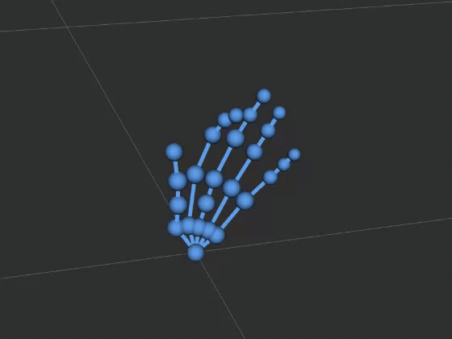

# rokoko-ros2-bridge

A ROS 2 bridge for Rokoko Smartgloves solved-hand data. It connects to
`rkk-hand-solver`'s solved-hand output and republishes it as ROS 2 topics,
an optional TF broadcast, optional RViz markers, and a yaw-calibration
service.



- [Prerequisites](#prerequisites)
- [Installing ROS 2](#installing-ros-2) — [Linux](#linux) · [macOS](#macos) · [Windows](#windows)
- [Building](#building)
- [Running](#running)
- [Published interface](#published-interface)
- [Calibrating](#calibrating)
- [Visualizing in RViz](#visualizing-in-rviz)
- [Configuration](#configuration)
- [Troubleshooting](#troubleshooting)
- [If you see flickering in RViz](#if-you-see-flickering-in-rviz)
- [License](#license)

---

## Prerequisites

**Rokoko Device SDK 0.10.0 or newer**, from
[sdk.rokoko.com](https://sdk.rokoko.com/). Earlier versions do not emit the
OpenXR joint group this bridge reads. It ships the driver and the hand
solver that the bridge sits behind; see the SDK's own documentation for
anything about those. Check your version with:

```sh
rokoko doctor
```

**Smartglovess**, connected over USB or WiFi.

**ROS 2 Lyrical Luth**, on Linux, macOS or Windows — see
[Installing ROS 2](#installing-ros-2).

> ROS 2's Python bindings (`rclpy` and the message packages) are not on
> PyPI — they exist only inside a ROS 2 installation and become importable
> when you source its `setup.bash`. A `venv` or `uv` environment cannot see
> them, so run this package against the system interpreter. If you need
> isolation, use a Docker image with ROS 2 inside it rather than a Python
> virtual environment.

---

## Installing ROS 2

This bridge targets **ROS 2 Lyrical Luth**. The official installation index
lists every supported platform and method — Debian packages, RPM packages,
binary archives, and source builds:

**[ROS 2 Lyrical Luth — Installation](https://docs.ros.org/en/lyrical/Get-Started/Installation.html)**

Pick whichever suits your machine; the sections below cover Linux, macOS
and Windows. Whatever you choose, you also need `colcon` to build the
workspace, and you must source the installation in every shell that runs
ROS 2 commands.

### Linux

On Debian and Ubuntu, install from the apt repositories:

**[Debian packages — install guide](https://docs.ros.org/en/lyrical/Get-Started/Installation/Ubuntu-Install-Debs.html)**

```sh
sudo apt install ros-lyrical-desktop   # includes RViz; several hundred packages
sudo apt install ros-dev-tools         # colcon, rosdep, vcstool
```

On other distributions, use the RPM packages or the binary archive from the
[installation index](https://docs.ros.org/en/lyrical/Get-Started/Installation.html)
— everything after this point works the same way.

Source it, and add the line to your `~/.bashrc` if you would rather not
repeat it:

```sh
source /opt/ros/lyrical/setup.bash
```

Verify with `ros2 doctor`.

### macOS

There are no binary packages for macOS, so ROS 2 is built from source:

**[macOS (source) — install guide](https://docs.ros.org/en/lyrical/Get-Started/Installation/Alternatives/macOS-Development-Setup.html)**

Two things to know before starting:

- It is a **source build** — expect a long compile, with Homebrew
  prerequisites rather than `apt`.
- It requires **disabling System Integrity Protection (SIP)**, which means
  rebooting into recovery mode. Read that part of the guide first.

Then source it, from wherever you built it:

```sh
source ~/ros2_lyrical/install/setup.bash
```

Everything from [Building](#building) onward is the same on every
platform.

### Windows

> Untested by the maintainers — reports welcome.

ROS 2 ships binary packages for Windows:

**[Windows (binary) — install guide](https://docs.ros.org/en/lyrical/Get-Started/Installation/Windows-Install-Binary.html)**

Nothing in this bridge is platform-specific — it is plain Python over a
TCP connection — so it should run once ROS 2 is installed. The part to
check first is whether the **Rokoko Device SDK is installed**,
since the driver and solver have to run somewhere; see the SDK's own
documentation.

Three differences from the commands elsewhere in this README:

- Source ROS 2 and the workspace with the batch scripts rather than
  `source`:
  ```bat
  call C:\dev\ros2_lyrical\local_setup.bat
  call install\setup.bat
  ```
- Use `python` rather than `python3`.
- In `upstream.yaml`, `executable:` may need to name the `.exe` or give a
  full path, depending on how the SDK installs.

---

## Building

```sh
cd ros2_ws
colcon build
source install/setup.bash
```

`install/setup.bash` has to be sourced in every new shell you launch or run
from. The workspace holds three packages:

| Package | Contents |
| --- | --- |
| `rkk_hand_msgs` | the message definitions |
| `rkk_hand_bridge` | the bridge node |
| `rkk_hand_bringup` | launch files for the whole chain |

Run the tests with:

```sh
python3 -m pytest src/rkk_hand_bridge/test/
```

---

## Running

Start everything — driver, solver and bridge — with one command:

```sh
ros2 launch rkk_hand_bringup smartglove_hands.launch.py
```

To also open RViz, and draw the hands in it:

```sh
ros2 launch rkk_hand_bringup smartglove_hands.launch.py \
  publish_markers:=true publish_tf:=true parent_frame_id:=world rviz:=true
```

Ctrl-C stops the bridge, the solver and the driver together.

**Attaching to a solver that is already running** — start the bridge alone:

```sh
ros2 launch rkk_hand_bridge hand_bridge.launch.py
```

The commands used for the driver and solver come from a config file — see
[Upstream config file](#upstream-config-file) to change them.

### Checking it works

In another sourced shell:

```sh
ros2 topic list
ros2 topic echo /rkk_hand_bridge/hand/description --once
ros2 topic echo /rkk_hand_bridge/hand/joints --once
ros2 topic echo /diagnostics --once
```

`hand/description` should name your device and list 26 joints;
`hand/joints` should show changing pose data as you move your hand.

---

## Published interface

| Name | Type | Notes |
| --- | --- | --- |
| `/rkk_hand_bridge/hand/description` | `rkk_hand_msgs/HandDescription` | one per hand, latched: device id, handedness, joint names and radii |
| `/rkk_hand_bridge/hand/joints` | `rkk_hand_msgs/HandJoints` | one per solved frame: 26 joint poses |
| `/rkk_hand_bridge/hand/markers` | `visualization_msgs/MarkerArray` | RViz drawing, off unless `publish_markers` is set |
| `/tf` | `tf2_msgs/TFMessage` | one transform per joint, off unless `publish_tf` is set |
| `/diagnostics` | `diagnostic_msgs/DiagnosticArray` | per-hand health, published every second |
| `/rkk_hand_bridge/calibrate` | `std_srvs/Trigger` | see [Calibrating](#calibrating) |

Joints are in `XrHandJointEXT` order and match `joint_names` in the
description.

The `hand` field carries one of the constants defined on the message —
`HAND_UNKNOWN` (0), `HAND_LEFT` (1) or `HAND_RIGHT` (2). Compare against
the constants rather than the numbers: 0 is reserved for unknown so that a
message whose `hand` was never set cannot pass for a real one.

TF frames are named `rkk_<hand>_hand_xr_<joint_name>`.

Two gloves are supported, one left and one right. Two gloves of the same
handedness are not.

---

## Calibrating

The solver streams poses referenced to magnetic north, so until you
calibrate, the hand is correct in shape but rotated by an arbitrary amount
about the vertical axis.

1. Call:

```sh
ros2 service call /rkk_hand_bridge/calibrate std_srvs/srv/Trigger {}
```

2. You now have `calibrate_delay_s` (5 seconds by default) to get into
   position — reaching for the keyboard to trigger the call is itself a
   hand movement, so the pose is sampled after the delay, not at the
   moment you press enter.
3. By the time the delay ends, hold your hand **level**, fingers
   pointing in the direction you want to become "forward". With two
   gloves, point **both hands the same way**.

A successful call names the hand it measured:

```
success: true
message: calibrated yaw offset to -2.834 rad from the left hand (device 843143769)
```

`/diagnostics` moves from `WARN`/"connected, yaw uncalibrated" to
`OK`/"connected" immediately, and RViz updates on the next frame. One
offset applies to every connected hand. Re-run it whenever you like.

"Forward" defaults to the parent frame's +X axis; `calibrate_facing_rad`
changes that.

---

## Visualizing in RViz

`HandJoints` is a custom message, so RViz cannot draw it directly. Two
options, both off by default and both needing `parent_frame_id`:

- **`publish_markers`** — a sphere per joint joined by a skeleton. This is
  the one that looks like a hand.
- **`publish_tf`** — a coordinate frame per joint. Useful for checking
  orientations, cluttered as a picture of a hand.

```sh
ros2 launch rkk_hand_bringup smartglove_hands.launch.py \
  publish_markers:=true publish_tf:=true parent_frame_id:=world rviz:=true
```

`rviz:=true` starts RViz with its own saved settings. Set it up once:

1. **Global Options** → **Fixed Frame** → `world` (or your
   `parent_frame_id`).
2. **Add** → **By topic** → `/rkk_hand_bridge/hand/markers` →
   **MarkerArray**.
3. **File → Save Config**, and it reopens that way.

RViz needs the fixed frame to exist in TF before it draws anything, which
is why the command above also passes `publish_tf:=true`. If your gloves
drop out, the frame goes with them; anchor it independently to avoid that:

```sh
ros2 run tf2_ros static_transform_publisher --frame-id world --child-frame-id rkk_hand_anchor
```

Each hand gets its own RViz namespaces — `rkk_<hand>_hand/joints` and
`rkk_<hand>_hand/bones` — so spheres and skeleton can be toggled
separately. Connected hands are drawn side by side rather than stacked.

---

## Configuration

### Node parameters

Every parameter can be set as a launch argument (`name:=value`) or changed
on a running node with `ros2 param set /rkk_hand_bridge <name> <value>`.
Numeric parameters are doubles, so write `0.0`, not `0`.

| Parameter | Default | Meaning |
| --- | --- | --- |
| `solver_host` | `127.0.0.1` | where the solver is |
| `solver_port` | `12277` | solver's port |
| `reconnect_delay_s` | `0.5` | wait before retrying a lost connection; doubles up to 10s |
| `stamp_source` | `auto` | `auto`, `epoch`, `offset` or `receive` — how `header.stamp` is derived |
| `parent_frame_id` | *(empty)* | frame TF and markers are published in; required for either |
| `publish_tf` | `false` | broadcast a transform per joint |
| `publish_markers` | `false` | publish RViz markers |
| `marker_rate_hz` | `40.0` | marker updates per second, shared across all hands |
| `marker_lifetime_s` | `0.5` | how long a marker survives without an update |
| `marker_joint_scale` | `1.0` | scales every joint sphere |
| `marker_max_joint_radius_m` | `0.010` | caps sphere size so wrists don't swamp fingers |
| `marker_hand_spacing_m` | `0.45` | how far apart hands are drawn |
| `calibrate_facing_rad` | `0.0` | direction calibration treats as forward |
| `calibrate_max_disagreement_rad` | `30°` | how far apart hands may point when calibrating |
| `calibrate_delay_s` | `5.0` | wait before sampling, so calling the service isn't itself the movement it measures |

Marker parameters affect the drawing only. `hand/joints` and `/tf` always
carry every frame of every hand at full rate.

Defaults live in
`ros2_ws/src/rkk_hand_bridge/rkk_hand_bridge/constants.py`. Change them
there and rebuild to change them permanently.

### Launch arguments

`rkk_hand_bringup`'s launch file adds:

| Argument | Default | Meaning |
| --- | --- | --- |
| `spawn_solver` | `true` | start the solver, or attach to a running one |
| `config` | *(packaged file)* | upstream config file, see below |
| `rviz` | `false` | open RViz alongside the bridge |

### Upstream config file

The solver and driver are ordinary programs rather than ROS nodes, so
their command lines live in a config file rather than being ROS
parameters:

**`ros2_ws/src/rkk_hand_bringup/config/upstream.yaml`**

```yaml
solver:
  executable: rkk-hand-solver
  args: ["--emit-openxr"]
  driver_args: ["--auto-stream-usb", "-ef", "1024"]
```

`args` runs the solver as written, and each entry of `driver_args` is
forwarded on to the driver. What those arguments mean is covered by the
Rokoko Device SDK's own documentation. `--emit-openxr` is the one this
bridge depends on: it is the joint group the bridge reads.

Edit that file, or point `config:=/path/to/my.yaml` at your own. Keys you
leave out fall back to the packaged file, so a partial file is fine.

To run the driver yourself rather than have the solver start it, add a
`driver` section and give the solver `--no-driver`:

```yaml
solver:
  executable: rkk-hand-solver
  args: ["--emit-openxr", "--no-driver"]

driver:
  executable: rokoko-sdk
  args: ["-vv", "-ef", "1024"]
```

That is also how to change the driver's arguments for **gloves on WiFi
rather than USB** — again, see the SDK documentation for which arguments
those are. WiFi gloves must be on the same network as this machine and
pointed at its LAN address rather than `127.0.0.1`.

---

## Troubleshooting

**`ros2: command not found`** — source ROS 2:
`source /opt/ros/lyrical/setup.bash`.

**`Package 'rkk_hand_bringup' not found`** — source the workspace:
`source install/setup.bash` from `ros2_ws`, after `colcon build`.

**`cannot reach the RGMP v2 server at 127.0.0.1:12276`** — the solver is
running but the driver is not. Start `rokoko-sdk`, or let the launch file
do it.

**No joints, and a warning about `joints_openxr`** — the solver was started
without `--emit-openxr`. `/diagnostics` reports this as an error naming the
device.

**`RBDP Protocol Error` / `Could not create device`** — the driver cannot
talk to the hub. Usually a stale process still holding the USB device:
check `pgrep -x rokoko-sdk`, kill it, and replug the hub.

**Nothing appears in RViz** — check the Fixed Frame matches
`parent_frame_id`, that you added the MarkerArray display on
`/rkk_hand_bridge/hand/markers`, and that `publish_markers:=true` was
passed.

**Hand is rotated the wrong way** — call the calibrate service, see
[Calibrating](#calibrating).

---

## If you see flickering in RViz

This is not caused by this bridge, or by any ROS node — it reproduces with
RViz opened on its own, with nothing publishing anything. It is a known,
unfixed bug in how Mutter (GNOME's compositor) handles XWayland clients
being resized:

- [ros2/rviz#1079 — major screen flickering/tearing](https://github.com/ros2/rviz/issues/1079)
- [ros2/rviz#1052 — flickering with HiDPI scaling enabled](https://github.com/ros2/rviz/issues/1052)
- [GNOME/mutter#2539 — non-interactive resizes cause black flicker](https://gitlab.gnome.org/GNOME/mutter/-/issues/2539)
- [GNOME/mutter#3241 — XWayland clients flickering since GNOME 45](https://gitlab.gnome.org/GNOME/mutter/-/issues/3241)

What actually triggers it is **resizing a window that is already on
screen** — maximizing, `-geometry`, snapping, tiling — not the size it
ends up at. A plain launch that is never resized afterward does not
flicker:

```sh
rviz2
```

Some people report Qt/GNOME environment variables that help on their
setup, but nothing reliable across machines — if it still flickers for
you, avoid resizing/maximizing the window, or live with it.

---

## License

Apache License 2.0 — see [LICENSE](LICENSE).

Contributions must be signed off under the [Developer Certificate of
Origin](DCO), unless covered by the [MAINTAINERS](MAINTAINERS) DCO
list; see [CONTRIBUTING.md](CONTRIBUTING.md).
